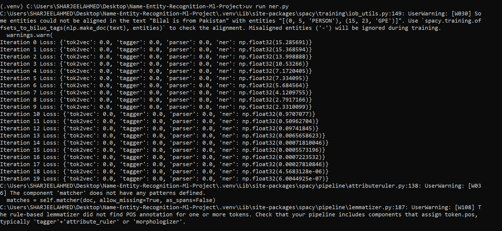
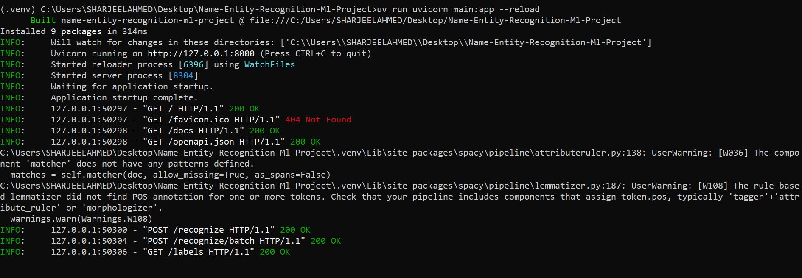
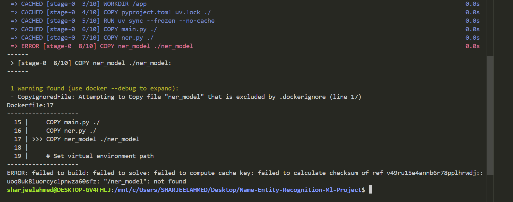
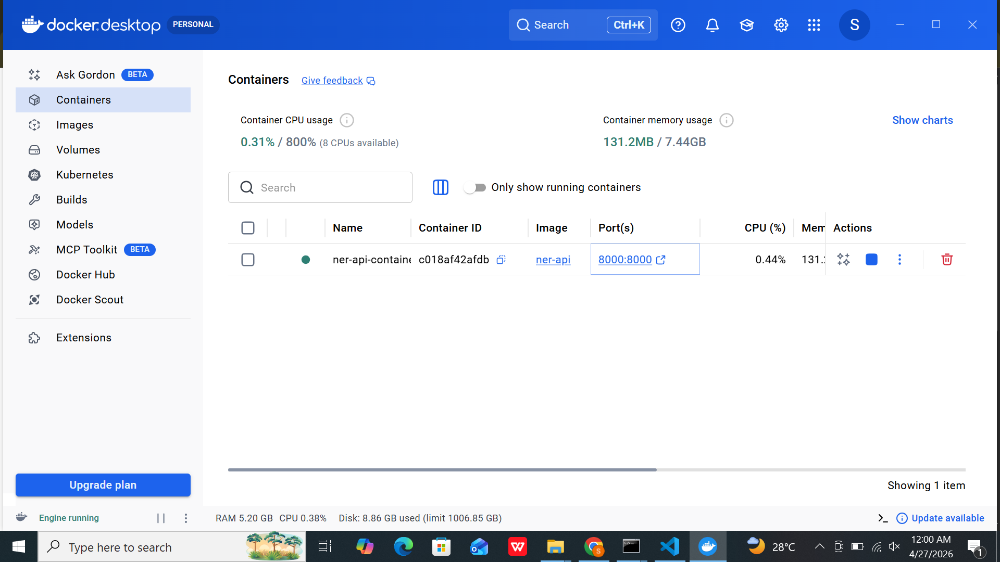
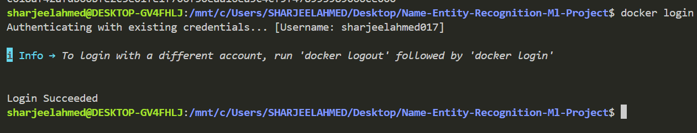

- create github repo
- git clone <repo_url>
- pip install uv
- uv venv --python 3.12 .venv
- .venv\Scripts\activate
- uv add spacy
- uv run python -m spacy download en_core_web_sm
- create file <ner.py>
- uv run <ner.py>
  
- uv add fastapi uvicorn
- crete fastapi endpoints in main.py file
  
- create .dockerignore and Dockerfile
- ask gpt to what content write in .dockerignore and Dockerfile
- you can also copy paste my content for Dockerfile and .dockerignore .
- create account on docker hub .
- setup linux envirment if you are using window .
- download and install docker desktop on pc/laptop .
- wsl --install -d Ubuntu
- in vs code terminal open wsl(ubuntu)
  
- activate cmd = wsl -d Ubuntu
- create docker image .
- docker build -t <image-name>
- before build image make sure docker desktop is open in your system .
- if you give any error when build image ask gpt to solve it .
  
- and rebuild image .
- rebuild again and again it saved image in cache .
- after creating image now run image on container .

- docker run <mode> <port> --name <container_name> <image_name>

# mode

- -it
- -d

# port type

- container port
- host port

- docker run -d -p 8000:8000 --name ner-api-container ner-api

- before push image in docker hub .
- add tag in image .
- login docker hub .
- docker login
  
