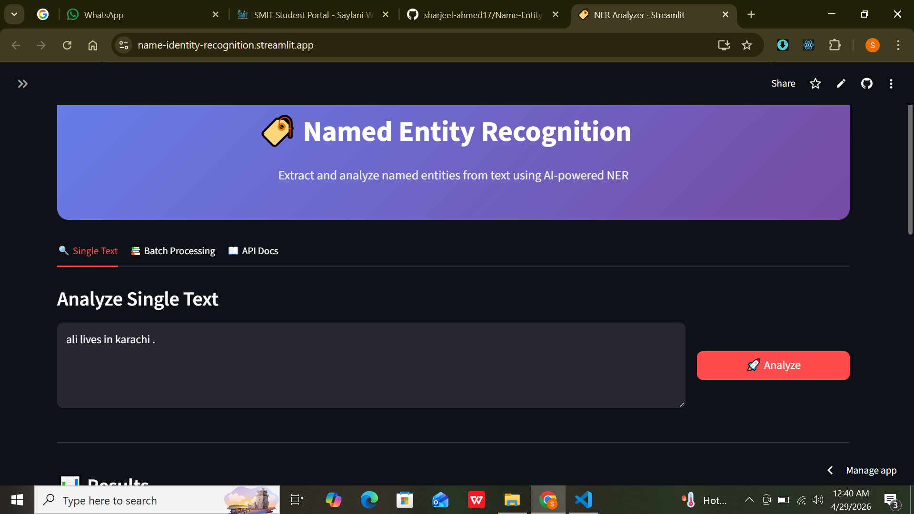
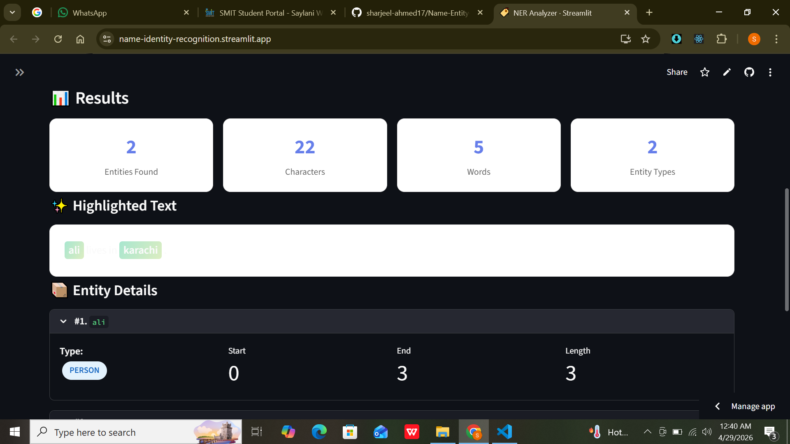
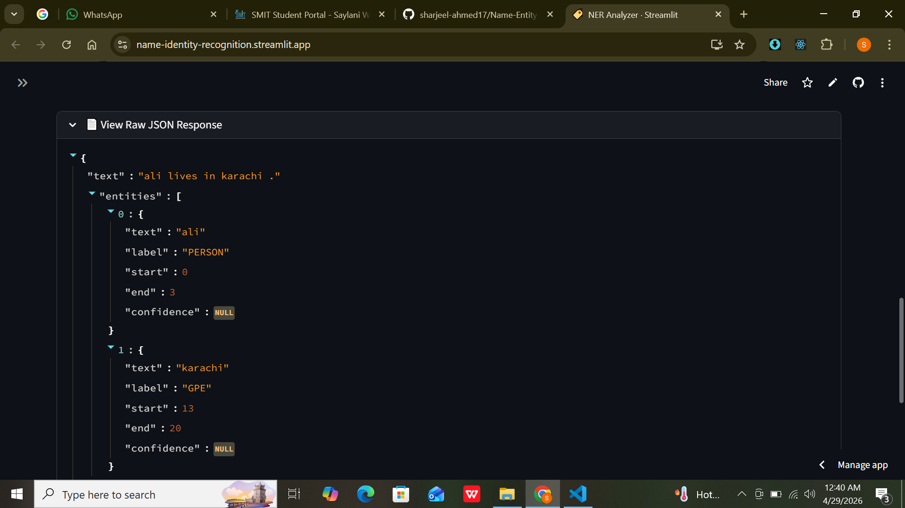
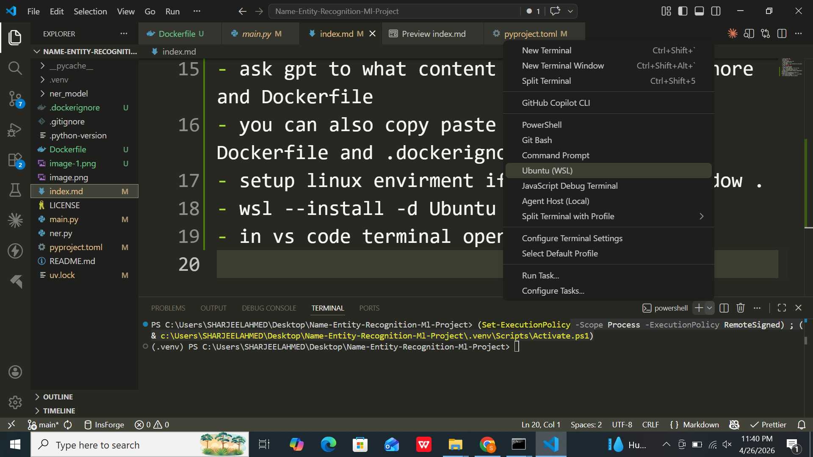
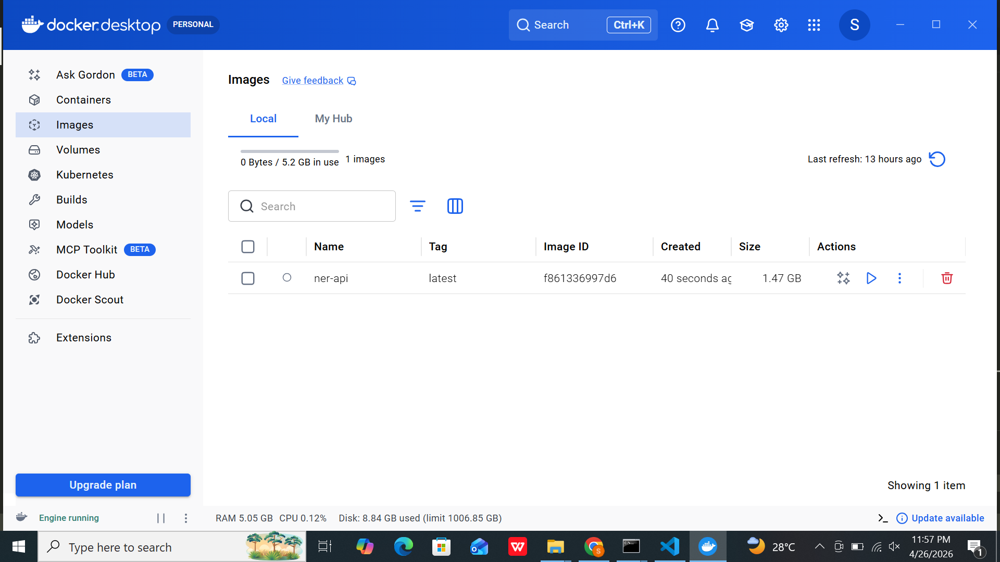
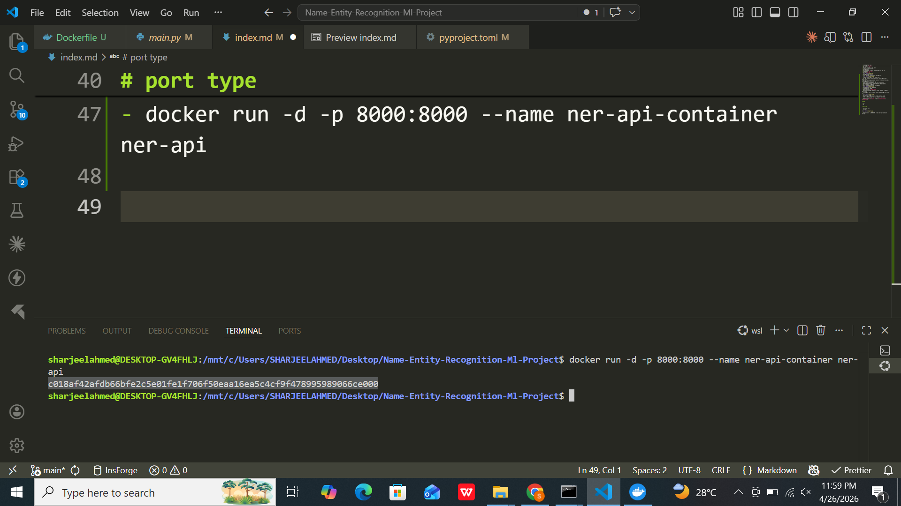
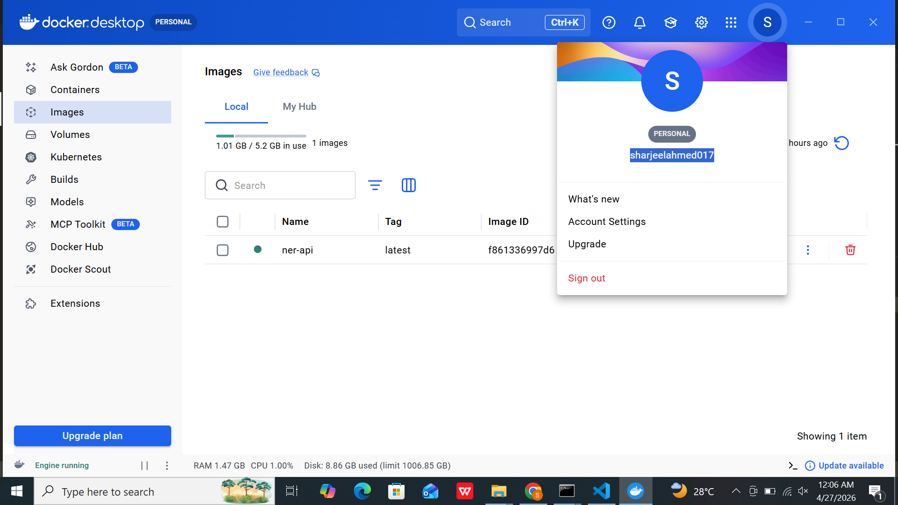
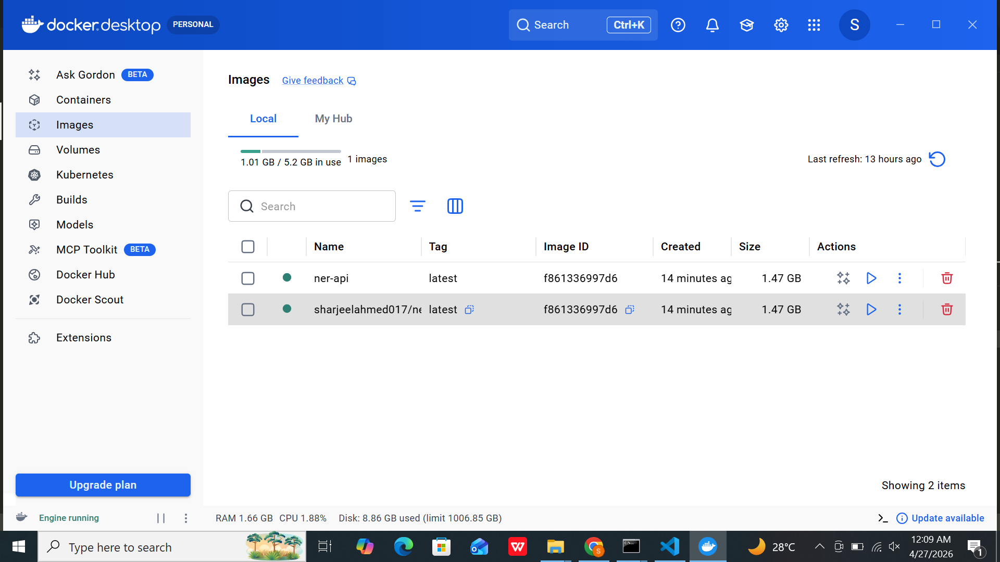

- create github repo
- git clone <repo_url>
- pip install uv <only one time install >
- create project and assignment using uv .

# why we use uv .

## 

---

## 🚀 Why use `uv` instead of `pip`?

- **⚡ Extreme Speed:** Up to 10–100x faster than pip due to its Rust core
- **📦 Built-in Virtualenvs:** Creates virtual environments in milliseconds without extra tools
- **🔄 Drop-in Compatibility:** Supports pip commands, making it easy to switch
- **💾 Global Cache:** Reuses downloads across projects to save disk space and time
- **🧠 Advanced Resolution:** Uses sophisticated logic to solve complex version conflicts
- **🧩 Single Binary:** No Python installation is required to run the manager itself
- **🛠️ Tool Management:** Can run Python scripts or tools (like Ruff or Black) in isolated temporary environments

---

- uv venv --python 3.12 .venv
- .venv\Scripts\activate
- uv add spacy
- uv run python -m spacy download en_core_web_sm
- create file <ner.py>
- uv run <ner.py>
  
- uv add fastapi uvicorn
- create fastapi endpoints in main.py file
  
- create .dockerignore and Dockerfile
- ask gpt to what content write in .dockerignore and Dockerfile
- you can also copy paste my content for Dockerfile and .dockerignore .
- create account on docker hub .
- setup linux envirment if you are using window .
- download and install docker desktop on pc/laptop .
- wsl --install -d Ubuntu
- in vs code terminal open wsl(ubuntu)
  
- activate cmd = wsl -d Ubuntu
- create docker image .
- docker build -t <image-name>
- before build image make sure docker desktop is open in your system .
- if you give any error when build image ask gpt to solve it .
  
- and rebuild image .
- rebuild again and again it saved image in cache .
- after creating image now run image on container .

- docker run <mode> <port> --name <container_name> <image_name>

# mode

- -it
- -d

# port type

- container port
- host port

- docker run -d -p 8000:8000 --name ner-api-container ner-api

- before push image in docker hub .
- add tag in image .
- login docker hub .
- docker login
  

- ## tag your image

---

docker tag <image_name> <docker_hub_username>/<image_name>:latest

---

- last but not least .
- push your image into docker hub .

- you can run my image on your machine linux , macos , windows .
- pull image

---

docker pull sharjeelahmed017/ner-api:latest

---

- run my image on your container.

--
docker run -d -p 8000:8000 --name ner-api-container ner-api

---

